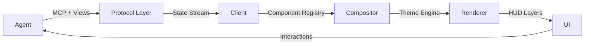

# 🦎 Chameleon Framework

**A Context-First Generative UI Protocol for AI Agents**

Transform your AI agents from text-based chat interfaces into dynamic, reactive workspaces that adapt based on agent state and context.

---

## ✨ What is Chameleon?

Chameleon is a revolutionary framework that extends the **Model Context Protocol (MCP)** to enable agents to generate rich, interactive user interfaces instead of just text responses.

### The Paradigm Shift

**Before (Chat-First):**
```
Agent: "Here are 3 hotel options..."
User: *reads wall of text*
```

**After (Context-First):**
```
Agent: *renders interactive comparison cards*
User: *clicks "Select" button*
```

---

## 🚀 Key Features

### 1. **View Primitives**
Extends MCP with a new `View` primitive alongside Resources, Prompts, and Tools.

### 2. **Real-Time State Streaming**
Stream state deltas via WebSocket/SSE instead of just text tokens.

### 3. **Multi-Layer HUD**
- **Peripheral**: Background status and progress
- **Focus**: Main workspace content
- **Interrupt**: Critical blockers and decisions

### 4. **Deployment Customization**
Each deployment can define its own:
- Brand identity (colors, typography, logo)
- Design principles (density, animations, effects)
- Interaction mechanisms (feedback modes, confirmations)
- Custom component overrides

### 5. **Generative Component Streaming**
Watch UI components build themselves in real-time as the agent "thinks".

---

## 📦 Installation

```bash
npm install @chameleon/client
# or
pip install chameleon-protocol
```

---

## 🎯 Quick Start

### Client Side (TypeScript)

```typescript
import { ChameleonRenderer } from '@chameleon/client';

const renderer = new ChameleonRenderer({
  container: '#app',
  mcpServerUrl: 'ws://localhost:3000',
  deploymentConfig: './config.json',
});

await renderer.start();
```

### Server Side (Python)

```python
from chameleon import MCPViewResponse, ViewContent

@mcp_tool
async def get_weather(location: str):
    return MCPViewResponse(
        content=[
            ViewContent(
                type="component",
                component_name="card",
                data={
                    "title": f"Weather in {location}",
                    "content": "Sunny, 22°C"
                }
            )
        ]
    )
```

### Deployment Config

```json
{
  "deployment_id": "my-app",
  "brand": {
    "name": "My Company",
    "theme": {
      "colors": {
        "primary": "#6366f1",
        "surface": "#1e293b"
      },
      "typography": {
        "heading": "Inter",
        "body": "Inter"
      }
    }
  },
  "design_principles": {
    "density": "comfortable",
    "animations": "smooth",
    "effects": {
      "glassmorphism": true
    }
  }
}
```

---

## 🎨 Built-in Components

- **Card** - Information containers with actions
- **Chart** - Line, bar, pie, area charts
- **Table** - Sortable, filterable tables
- **Form** - Dynamic form builder
- **Gauge** - Single metric visualization
- **Timeline** - Chronological events
- **Kanban** - Task boards
- **Progress** - Multi-step progress indicators

---

## 🏗️ Architecture



---

## 📚 Examples

### Weather Dashboard
```bash
cd examples/weather-dashboard
python server.py &
open index.html
```

### Data Analysis
```bash
cd examples/data-analysis
npm run dev
```

---

## 🎭 Use Cases

### 1. Dynamic Forms
Instead of asking 5 separate questions, generate a complete form in one go.

### 2. Live Progress
Show real-time pipeline visualization as the agent processes data.

### 3. Interactive Comparisons
Render side-by-side cards with "Select" buttons instead of text lists.

### 4. Streaming Visualizations
Build charts progressively as data is analyzed.

---

## 🔧 Customization

### Custom Components

```typescript
import { defineComponent } from '@chameleon/client';

const MyCustomCard = defineComponent('custom-card', (props, container) => {
  const element = document.createElement('div');
  element.innerHTML = `<h3>${props.title}</h3>`;
  container.appendChild(element);
  
  return {
    element,
    update: (newProps) => {
      element.innerHTML = `<h3>${newProps.title}</h3>`;
    },
  };
});

renderer.getRegistry().register(MyCustomCard);
```

### Override in Deployment

```json
{
  "component_overrides": {
    "card": {
      "module": "./components/MyCustomCard.tsx"
    }
  }
}
```

---

## 📖 Documentation

- [Protocol Specification](./specs/README.md)
- [Component Schema](./specs/component-schema.json)
- [Deployment Config](./specs/deployment-config.schema.json)
- [API Reference](./docs/api.md)

---

## 🤝 Contributing

We welcome contributions! Please see [CONTRIBUTING.md](./CONTRIBUTING.md).

---

## 📄 License

MIT License - see [LICENSE](./LICENSE)

---

## 🌟 Why "Chameleon"?

Like a chameleon adapts its appearance to its environment, this framework adapts the UI based on:
- **Agent State**: What the agent is doing right now
- **Data Type**: Weather data → Gauge, Sales data → Chart
- **Deployment**: Each customer gets their branded experience

The interface **becomes** what the context requires.

---

## 🚀 Roadmap

- [x] Core protocol specification
- [x] TypeScript client library
- [x] Python server SDK
- [ ] React component library
- [ ] Vue.js integration
- [ ] Voice input support
- [ ] Collaboration features
- [ ] Analytics integration

---

## 💬 Community

- [Discord](https://discord.gg/chameleon)
- [Twitter](https://twitter.com/chameleon_ui)
- [GitHub Discussions](https://github.com/chameleon/discussions)

---

**Built with ❤️ by developers who believe AI deserves better interfaces**
