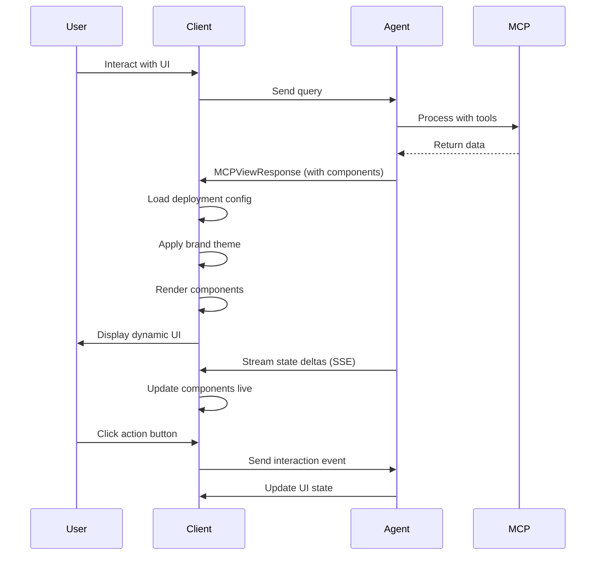

# Chameleon Protocol Specifications

This directory contains the formal JSON Schema specifications for the Chameleon Framework.

## Overview

Chameleon is a **Context-First generative UI protocol** that extends MCP (Model Context Protocol) to enable agents to generate dynamic, reactive user interfaces instead of just text responses.

## Specifications

### [chameleon-protocol.json](./chameleon-protocol.json)

The core protocol specification extending MCP with:

- **View Content**: Component definitions that agents can return
- **State Deltas**: Real-time UI update events
- **Stream Events**: Continuous state synchronization events
- **Interaction Events**: User interaction feedback to agents
- **Multi-Layer System**: Peripheral, Focus, and Interrupt layers

### [deployment-config.schema.json](./deployment-config.schema.json)

Per-deployment customization schema for:

- **Brand Identity**: Logo, colors, typography
- **Design Principles**: Density, animations, effects
- **Interaction Mechanisms**: Feedback modes, confirmations, error handling
- **Component Overrides**: Custom component implementations
- **Feature Flags**: Optional functionality toggles
- **Localization**: Multi-language support

### [component-schema.json](./component-schema.json)

Standard component library definitions:

**Data Display:**
- `card` - Information containers
- `chart` - Data visualizations (line, bar, pie, etc.)
- `table` - Tabular data with sorting/filtering
- `gauge` - Single metric visualization
- `timeline` - Chronological events

**Input & Forms:**
- `form` - Dynamic form builder
- Input fields, selects, checkboxes, etc.

**Specialized:**
- `kanban` - Task management boards
- `progress` - Step-by-step progress visualization
- `alert` - Notifications and banners

## Usage

### Agent Side (MCP Server)

```python
from chameleon import MCPViewResponse, ViewContent

@mcp_tool
async def analyze_data(query: str):
    data = await process_query(query)
    
    return MCPViewResponse(
        content=[
            ViewContent(
                type="component",
                component_name="chart",
                data={
                    "chart_type": "line",
                    "data": {
                        "labels": ["Jan", "Feb", "Mar"],
                        "datasets": [{
                            "label": "Sales",
                            "data": [10, 20, 35]
                        }]
                    }
                },
                interactive=True,
                layer="focus"
            )
        ]
    )
```

### Client Side

```typescript
import { ChameleonRenderer } from '@chameleon/client';
import deploymentConfig from './deployment-config.json';

const renderer = new ChameleonRenderer({
  deployment: deploymentConfig,
  mcpServerUrl: 'ws://localhost:3000'
});

renderer.render('#app');
```

### Deployment Configuration

```json
{
  "deployment_id": "acme-corp",
  "brand": {
    "name": "Acme Corporation",
    "theme": {
      "colors": {
        "primary": "#6366f1",
        "secondary": "#8b5cf6"
      },
      "typography": {
        "heading": "Inter",
        "body": "Roboto"
      }
    }
  },
  "design_principles": {
    "density": "comfortable",
    "animations": "smooth"
  },
  "component_overrides": {
    "card": {
      "module": "./components/AcmeCard.tsx"
    }
  }
}
```

## Protocol Flow



## Validation

Validate your configurations:

```bash
# Validate deployment config
npm run validate:deployment ./deployments/acme-corp/config.json

# Validate component data
npm run validate:component chart ./data/chart-config.json

# Validate protocol response
npm run validate:response ./test-data/response.json
```

## Version

Current version: **1.0.0**

## License

MIT
